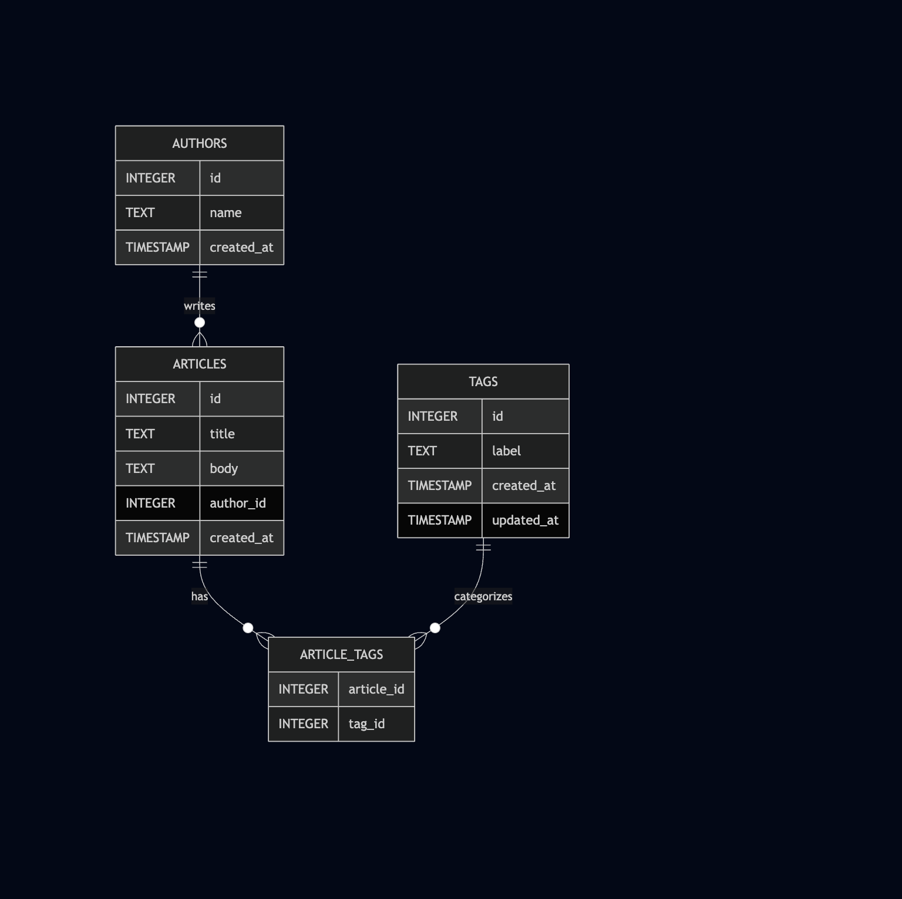

# mini-search-platform

The Mini Search Platform is a news platform specialised in making articles searchable.

The system is inspired by a real-world and proprietary implementation of a Search Platform that runs for the webshop https://momoxfashion.com (company where I work at the time of writing). Some features were removed and others were added based on my wishes for an open-source version of the product.

All functionatilly is exposed to collaborating systems via a unified REST API. Therefore, no user interface is available within this project.

# Table of Contents

- [Functional requirements](#functional-requirements)
- [Non-functional requirements](#non-functional-requirements)
- [Local setup](#local-setup)
- [Entity-relationship Model](#️-entity-relationship-model-er-model)
- [Further information](#further-information)

## Functional requirements

The initial version of the system provides search capability to a publishing platform where articles, tags and authors are managed via CRUD operations and made searcheable via the `/search` endpoint.

### Articles

- `POST /articles`
  Create a single article with metadata (title, body, author, tags).
  Automatically syncs the article to the search index.
- `POST /articles/batch`
  Create multiple articles in one request.
  Each article includes an author and a list of tags.
  All articles are synced to the search engine after insert.

### Authors

- `POST /authors`
  Create a new author with a unique ID and name.
- `POST /authors/batch`
  Batch insert multiple authors.
  Useful during initial data ingestion or import operations.

### Tags

- `POST /tags`
  Add a new tag by label.
  If the tag already exists, it can be updated or rejected depending on backend logic.
- `PATCH /tags/:label`
  Update the label of an existing tag.
  Triggers a background resync of related articles in the search index to reflect the updated tag.
- `POST /tags/batch`
  Batch insert multiple tags.
  Returns a summary of how many were inserted vs. failed.
- `GET /tags`
  List all tags stored in the database.
  Supports use in filtering UIs or autocomplete features.
- `GET /tags/:label`
  Retrieve a single tag by its label.
  Useful for checking if a tag exists before assigning it to an article.
- `GET /tags/:label/articles`
  Fetch all articles that are associated with a tag matching the provided label.
  Returns full articles, each with a list of their tags (not just the matching one).

### Search

- `GET /search`
  Perform a full-text search across articles via the search engine.
  Supports keyword queries and may include filters (e.g., by tag or author) depending on implementation.

### Products (TBD)

- Similar to `articles` products should be available as a a possible index type to be made searchable with optimised defaults and pre-defined schema.

### Catalogue (TBD)

- Manage different catalogues based on different marketplaces/languages.
- Enrich catalogue raw data with additional categories and attributes.

### Tenants (TBD)

- Multiple tenants should have its own isolated space to generate API tokens and manage catalogues.

## Non-functional requirements

1. Durability: fault tolerance & archivability of historical data.
2. Agility: strive for streamlined maintenance & isolated testing.
3. Resiliency: service should not stop if dependencies are down or slow to respond (e.g.Cloud Translation API).

## Local setup

### 1. Starting Meilisearch container

docker run -it --rm -p 7700:7700 getmeili/meilisearch

### 2. Starting the application

go run cmd/server/main.go

**Note:** the local setup relies on a SQLite database with in-memory driver.

## Sample requests

Sample requests are available at [examples/postman_collection.json](examples/postman_collection.json)

## 🗂️ Entity-Relationship Model (ER Model)

This system models a publishing platform with articles, authors, and tags. It supports a many-to-many relationship between articles and tags.

### T: `authors`

| Column       | Type      | Constraints                     |
| ------------ | --------- | ------------------------------- |
| `id`         | INTEGER   | Primary key, Auto-increment     |
| `name`       | TEXT      | Not null, Unique                |
| `created_at` | TIMESTAMP | Defaults to `CURRENT_TIMESTAMP` |

Indexes:
• Unique index on name

Relationships:
• One-to-Many: An author writes many articles

---

### T: `articles`

| Column       | Type      | Constraints                           |
| ------------ | --------- | ------------------------------------- |
| `id`         | INTEGER   | Primary key, Auto-increment           |
| `title`      | TEXT      | Not null                              |
| `body`       | TEXT      | Not null                              |
| `author_id`  | INTEGER   | Foreign key → `authors(id)`, Not null |
| `created_at` | TIMESTAMP | Defaults to `CURRENT_TIMESTAMP`       |

Indexes:
• Foreign key index on author_id

Relationships:
• Many-to-One: Each article is written by one author
• Many-to-Many: Articles can have multiple tags

---

### T: `tags`

| Column       | Type      | Constraints                     |
| ------------ | --------- | ------------------------------- |
| `id`         | INTEGER   | Primary key, Auto-increment     |
| `label`      | TEXT      | Not null, Unique                |
| `created_at` | TIMESTAMP | Defaults to `CURRENT_TIMESTAMP` |
| `updated_at` | TIMESTAMP | Nullable                        |

Indexes:
• Unique index on label

Relationships:
• Many-to-Many: Tags can be assigned to many articles

---

### T: `article_tags`

| Column       | Type    | Constraints                                               |
| ------------ | ------- | --------------------------------------------------------- |
| `article_id` | INTEGER | Primary key (with `tag_id`), Foreign key → `articles(id)` |
| `tag_id`     | INTEGER | Primary key (with `article_id`), Foreign key → `tags(id)` |

Indexes:
• Composite primary key: (article_id, tag_id)
• Foreign key indexes on both article_id and tag_id

Relationships:
• Many-to-Many:
• One article ↔ Many tags
• One tag ↔ Many articles

---

### T: `products`

| Column       | Type      | Constraints                     |
| ------------ | --------- | ------------------------------- |
| `article_id` | TEXT      | Primary key                     |
| `title`      | TEXT      | Not null                        |
| `brand`      | TEXT      | Not null                        |
| `category`   | TEXT      | Not null                        |
| `created_at` | TIMESTAMP | Defaults to `CURRENT_TIMESTAMP` |
| `updated_at` | TIMESTAMP | Defaults to `CURRENT_TIMESTAMP` |

Indexes:
• Primary key on `article_id`

Relationships:
• One-to-Many: A product can have multiple variants (`variants.article_id → products.article_id`)

---

### T: `variants`

| Column         | Type      | Constraints                                    |
| -------------- | --------- | ---------------------------------------------- |
| `variant_id`   | TEXT      | Primary key                                    |
| `article_id`   | TEXT      | Foreign key → `products(article_id)`, Not null |
| `size`         | TEXT      | Not null                                       |
| `color`        | TEXT      | Not null                                       |
| `price`        | FLOAT     | Not null                                       |
| `availability` | BOOLEAN   | Not null                                       |
| `updated_at`   | TIMESTAMP | Defaults to `CURRENT_TIMESTAMP`                |

Indexes:
• Foreign key index on `article_id`  
• Composite index on (`article_id`, `size`, `color`) for fast variant lookup

Relationships:
• Many-to-One: Each variant belongs to one product (`article_id`)
• One-to-Many: A product can have multiple variants

### Visual Diagram

## Search Index

The platform allows for dynamic creation of new search indexes matching one of the available types `Article` or `Product`, which will follow a pre-defined schema optimised for each use case.

### I: `artifcles`

| Field  | Type       | Searchable | Filterable | Sortable | Description                          |
| ------ | ---------- | ---------- | ---------- | -------- | ------------------------------------ |
| id     | `string`   | No         | No         | No       | Unique ID of the article             |
| title  | `string`   | Yes        | No         | Yes      | Title of the article                 |
| body   | `string`   | Yes        | No         | No       | Full body/content of the article     |
| author | `string`   | Yes        | Yes        | Yes      | Name of the article's author         |
| tags   | `string[]` | Yes        | Yes        | No       | List of tags assigned to the article |

### I: `products` (TBD)

| Field                       | Type       | Searchable | Filterable | Sortable | Description                                        |
| --------------------------- | ---------- | ---------- | ---------- | -------- | -------------------------------------------------- |
| article_id                  | `string`   | No         | No         | No       | Unique product identifier                          |
| title                       | `string`   | Yes        | No         | Yes      | Product title used in search                       |
| brand                       | `string`   | Yes        | Yes        | Yes      | Brand name                                         |
| category                    | `string`   | Yes        | Yes        | Yes      | Product category (e.g., "shoes")                   |
| facet_data.available_sizes  | `string[]` | No         | Yes        | No       | Aggregated list of available sizes across variants |
| facet_data.available_colors | `string[]` | No         | Yes        | No       | Aggregated list of available colors                |
| facet_data.is_in_stock      | `boolean`  | No         | Yes        | No       | True if at least one variant is in stock           |

More details at [meilisearch.go](internal/adapters/meilisearch.go)

## Further information

- [Architectural Overview](ARCHITECTURE.md)
- [Architectural Decision Records (ADRs)](decisions/README.md)
- [Threat Model Analysis](THREAT_MODEL_ANALYSIS.md)
