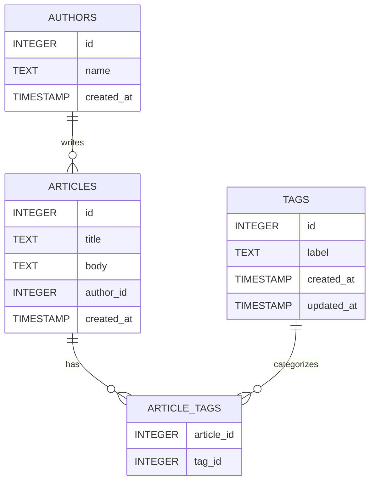

```mermaid
erDiagram
  AUTHORS ||--o{ ARTICLES : writes
  ARTICLES ||--o{ ARTICLE_TAGS : has
  TAGS ||--o{ ARTICLE_TAGS : categorizes

  AUTHORS {
    INTEGER id
    TEXT name
    TIMESTAMP created_at
  }

  ARTICLES {
    INTEGER id
    TEXT title
    TEXT body
    INTEGER author_id
    TIMESTAMP created_at
  }

  TAGS {
    INTEGER id
    TEXT label
    TIMESTAMP created_at
    TIMESTAMP updated_at
  }

  ARTICLE_TAGS {
    INTEGER article_id
    INTEGER tag_id
  }
```
